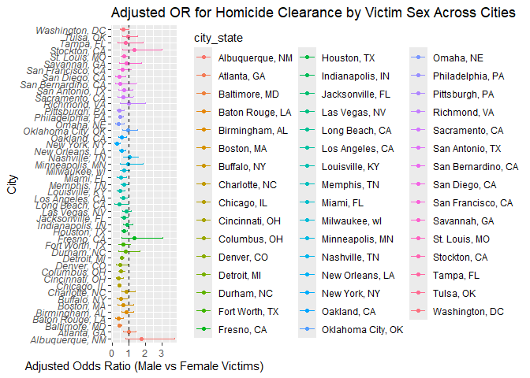
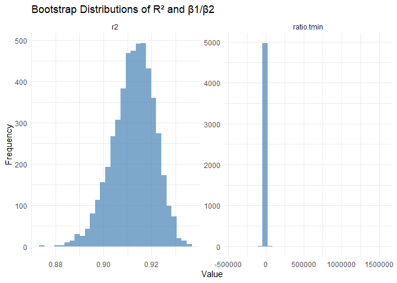

2025-12-03_p8105_hw6_tw3128.Rmd
================
Chris
2025-12-03

# Problem One

``` r
df_homicide <- read_csv("data/homicide-data.csv") |>
  clean_names()
```

    ## Rows: 52179 Columns: 12
    ## ── Column specification ────────────────────────────────────────────────────────
    ## Delimiter: ","
    ## chr (9): uid, victim_last, victim_first, victim_race, victim_age, victim_sex...
    ## dbl (3): reported_date, lat, lon
    ## 
    ## ℹ Use `spec()` to retrieve the full column specification for this data.
    ## ℹ Specify the column types or set `show_col_types = FALSE` to quiet this message.

## city_state

``` r
df_homicide <- df_homicide |>
  mutate(city_state = paste(city, state, sep = ", ")) |>
  filter(!city_state %in% c("Dallas, TX", "Phoenix, AZ", "Kansas City, MO", "Tulsa, AL")) |>
  filter(victim_race %in% c("White", "Black")) |>
  mutate(
    victim_age = as.numeric(victim_age))
```

    ## Warning: There was 1 warning in `mutate()`.
    ## ℹ In argument: `victim_age = as.numeric(victim_age)`.
    ## Caused by warning:
    ## ! NAs introduced by coercion

## Baltimore, MD

``` r
df_baltimore <- df_homicide |>
  filter(city_state == "Baltimore, MD") |>
  mutate(
    resolved = ifelse(disposition == "Closed by arrest", 1, 0),
    victim_race = as.factor(victim_race),
    victim_sex = as.factor(victim_sex)
  )

model_lgt <- 
  glm(resolved ~ victim_age + victim_sex + victim_race, family = binomial, data = df_baltimore) 
result <- tidy(model_lgt, exponentiate = TRUE, conf.int = TRUE)
result
```

    ## # A tibble: 4 × 7
    ##   term             estimate std.error statistic  p.value conf.low conf.high
    ##   <chr>               <dbl>     <dbl>     <dbl>    <dbl>    <dbl>     <dbl>
    ## 1 (Intercept)         1.36    0.171        1.81 7.04e- 2    0.976     1.91 
    ## 2 victim_age          0.993   0.00332     -2.02 4.30e- 2    0.987     1.000
    ## 3 victim_sexMale      0.426   0.138       -6.18 6.26e-10    0.324     0.558
    ## 4 victim_raceWhite    2.32    0.175        4.82 1.45e- 6    1.65      3.28

Keeping other factors fixed, the male victims have 0.4256 times odds of
being resolved compared with female victims, and the 0.95 confidence
interval is `[0.3241908, 0.5575508]`.

## All Cities

``` r
df_homicide <- df_homicide |>
   mutate(
    resolved = ifelse(disposition == "Closed by arrest", 1, 0),
    victim_race = as.factor(victim_race),
    victim_sex = as.factor(victim_sex)
  )

df_cities_results <- df_homicide |>
  group_by(city_state) |>
  nest() |>
  mutate(
    model = map(data, ~ glm(resolved ~ victim_age + victim_sex + victim_race,
                            data = .x, family = binomial)),
    tidy_res = map(model, ~ tidy(.x, exponentiate = TRUE,
                                 conf.int = TRUE))
  ) |>
  unnest(tidy_res) |>
  filter(term == "victim_sexMale") |> 
  select(city_state, estimate, conf.low, conf.high)
```

    ## Warning: There were 43 warnings in `mutate()`.
    ## The first warning was:
    ## ℹ In argument: `tidy_res = map(model, ~tidy(.x, exponentiate = TRUE, conf.int =
    ##   TRUE))`.
    ## ℹ In group 1: `city_state = "Albuquerque, NM"`.
    ## Caused by warning:
    ## ! glm.fit: fitted probabilities numerically 0 or 1 occurred
    ## ℹ Run `dplyr::last_dplyr_warnings()` to see the 42 remaining warnings.

## Make a Plot

``` r
df_cities_results <- df_cities_results |>
  arrange(estimate) |>
  mutate(city_state = factor(city_state, levels = city_state)) 

df_cities_results |>
  ggplot(aes(x = estimate, y = city_state, color = city_state)) + 
  geom_point() +
  geom_errorbarh(aes(xmin = conf.low, xmax = conf.high), height = 0.2) +
  geom_vline(xintercept = 1, linetype = "dashed") + 
  labs(
    x = "Adjusted Odds Ratio (Male vs Female Victims)",
    y = "City",
    title = "Adjusted OR for Homicide Clearance by Victim Sex Across Cities"
  ) +
  theme(axis.text.y = element_text(face = "italic"))
```

    ## Warning: `geom_errobarh()` was deprecated in ggplot2 4.0.0.
    ## ℹ Please use the `orientation` argument of `geom_errorbar()` instead.
    ## This warning is displayed once every 8 hours.
    ## Call `lifecycle::last_lifecycle_warnings()` to see where this warning was
    ## generated.

    ## `height` was translated to `width`.

<!-- -->

Most cities have an OR \< 1, indicating lower odds of clearance for male
victims compared to female victims.

Some cities show wide confidence intervals, suggesting uncertainty due
to smaller sample sizes.

Cities where the CI crosses 1.0 suggest no strong evidence of a sex
difference in clearance odds.

# Problem Two

``` r
library(p8105.datasets)
data(weather_df)
```

## Fit One Linear Model

``` r
mlr_fit <- lm(tmax ~ tmin + prcp, data = weather_df)
summary(mlr_fit)
```

    ## 
    ## Call:
    ## lm(formula = tmax ~ tmin + prcp, data = weather_df)
    ## 
    ## Residuals:
    ##     Min      1Q  Median      3Q     Max 
    ## -6.5357 -2.0070 -0.3252  1.8643 22.6490 
    ## 
    ## Coefficients:
    ##               Estimate Std. Error t value Pr(>|t|)    
    ## (Intercept)  7.7756380  0.0854060  91.043   <2e-16 ***
    ## tmin         1.0174796  0.0055814 182.299   <2e-16 ***
    ## prcp        -0.0055783  0.0005927  -9.411   <2e-16 ***
    ## ---
    ## Signif. codes:  0 '***' 0.001 '**' 0.01 '*' 0.05 '.' 0.1 ' ' 1
    ## 
    ## Residual standard error: 2.73 on 2168 degrees of freedom
    ##   (19 observations deleted due to missingness)
    ## Multiple R-squared:  0.9409, Adjusted R-squared:  0.9408 
    ## F-statistic: 1.724e+04 on 2 and 2168 DF,  p-value: < 2.2e-16

``` r
# extracting some outcomes
r_square_hat <- summary(mlr_fit)$r.squared

coef_hat <- coef(mlr_fit)
beta1_hat <- coef_hat["tmin"]
beta2_hat <- coef_hat["prcp"]

ratio_hat <- beta1_hat / beta2_hat
r_square_hat
```

    ## [1] 0.9408579

``` r
ratio_hat
```

    ##      tmin 
    ## -182.4002

## A Function

``` r
boot_start <- function(data) {
  fit <- lm(tmax ~ tmin + prcp, data = data)
  
  r2 <- summary(fit)$r.squared
  beta <- coef(fit)
  ratio <- beta["tmin"] / beta["prcp"]
  
  c(r2 = r2, ratio = ratio)
}

boot_start(weather_df)
```

    ##           r2   ratio.tmin 
    ##    0.9408579 -182.4001743

## Bootstrap

``` r
set.seed(20251203)

n_boot <- 5000
n <- nrow(weather_df)

boot_results <- 
  replicate(n_boot, {
    df_boot <- weather_df[sample(1:n, n, replace = TRUE), ]
    boot_start(df_boot)
  })

boot_results <- t(boot_results) |>
  as.data.frame()
```

## Make a Plot

``` r
boot_results_long <- 
  boot_results |>
  pivot_longer(cols = everything(),
               names_to = "statistic",
               values_to = "value")

ggplot(boot_results_long, aes(x = value)) +
  geom_histogram(bins = 30, fill = "steelblue", alpha = 0.7) +
  facet_wrap(~ statistic, scales = "free") +
  theme_minimal() +
  labs(
    title = "Bootstrap Distributions of R² and β1/β2",
    x = "Value",
    y = "Frequency"
  )
```

<!-- -->

``` r
CI_r2 <- quantile(boot_results$r2, c(0.025, 0.975))
CI_ratio <- quantile(boot_results$ratio, c(0.025, 0.975))

CI_r2
```

    ##      2.5%     97.5% 
    ## 0.9345777 0.9466724

``` r
CI_ratio
```

    ##      2.5%     97.5% 
    ## -279.5677 -124.9712

The figure shows the bootstrap distributions of the coefficient of
determination r^2 and the regression coefficient ratio beta1^hat /
beta2^hat. The bootstrap distribution of r^2 is fairly narrow and
approximately symmetric around values close to 0.94, indicating that the
model consistently explains a large proportion of variability in maximum
temperature across resampled datasets. This suggests that the model fit
is highly stable.

In contrast, the distribution of beta1^hat / beta2^hat shows greater
spread and noticeable left-skewness. This indicates more uncertainty in
the relative strength between the effects of minimum temperature and
precipitation on maximum temperature. The larger sampling variability
suggests that the effect ratio is less stable and potentially more
sensitive to the specific observations included in the dataset.
