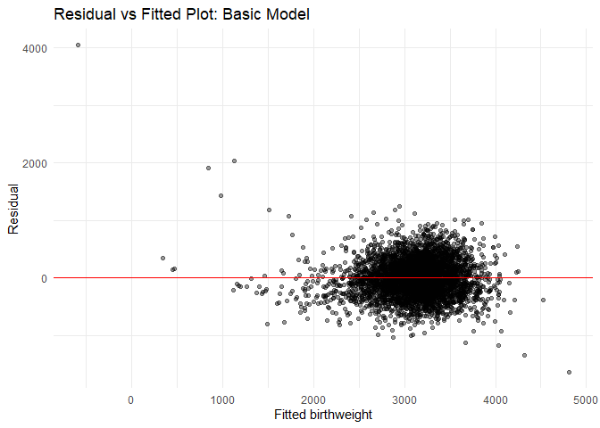

2025-12-03_p8105_hw6_tw3128.Rmd
================
Chris
2025-12-03

# Problem One

``` r
df_homicide <- read_csv("data/homicide-data.csv") |>
  clean_names()
```

    ## Rows: 52179 Columns: 12
    ## ── Column specification ────────────────────────────────────────────────────────
    ## Delimiter: ","
    ## chr (9): uid, victim_last, victim_first, victim_race, victim_age, victim_sex...
    ## dbl (3): reported_date, lat, lon
    ## 
    ## ℹ Use `spec()` to retrieve the full column specification for this data.
    ## ℹ Specify the column types or set `show_col_types = FALSE` to quiet this message.

## city_state

``` r
df_homicide <- df_homicide |>
  mutate(city_state = paste(city, state, sep = ", ")) |>
  filter(!city_state %in% c("Dallas, TX", "Phoenix, AZ", "Kansas City, MO", "Tulsa, AL")) |>
  filter(victim_race %in% c("White", "Black")) |>
  mutate(
    victim_age = as.numeric(victim_age))
```

    ## Warning: There was 1 warning in `mutate()`.
    ## ℹ In argument: `victim_age = as.numeric(victim_age)`.
    ## Caused by warning:
    ## ! NAs introduced by coercion

## Baltimore, MD

``` r
df_baltimore <- df_homicide |>
  filter(city_state == "Baltimore, MD") |>
  mutate(
    resolved = ifelse(disposition == "Closed by arrest", 1, 0),
    victim_race = as.factor(victim_race),
    victim_sex = as.factor(victim_sex)
  )

model_lgt <- 
  glm(resolved ~ victim_age + victim_sex + victim_race, family = binomial, data = df_baltimore) 
result <- tidy(model_lgt, exponentiate = TRUE, conf.int = TRUE)
result
```

    ## # A tibble: 4 × 7
    ##   term             estimate std.error statistic  p.value conf.low conf.high
    ##   <chr>               <dbl>     <dbl>     <dbl>    <dbl>    <dbl>     <dbl>
    ## 1 (Intercept)         1.36    0.171        1.81 7.04e- 2    0.976     1.91 
    ## 2 victim_age          0.993   0.00332     -2.02 4.30e- 2    0.987     1.000
    ## 3 victim_sexMale      0.426   0.138       -6.18 6.26e-10    0.324     0.558
    ## 4 victim_raceWhite    2.32    0.175        4.82 1.45e- 6    1.65      3.28

Keeping other factors fixed, the male victims have 0.4256 times odds of
being resolved compared with female victims, and the 0.95 confidence
interval is `[0.3241908, 0.5575508]`.

## All Cities

``` r
df_homicide <- df_homicide |>
   mutate(
    resolved = ifelse(disposition == "Closed by arrest", 1, 0),
    victim_race = as.factor(victim_race),
    victim_sex = as.factor(victim_sex)
  )

df_cities_results <- df_homicide |>
  group_by(city_state) |>
  nest() |>
  mutate(
    model = map(data, ~ glm(resolved ~ victim_age + victim_sex + victim_race,
                            data = .x, family = binomial)),
    tidy_res = map(model, ~ tidy(.x, exponentiate = TRUE,
                                 conf.int = TRUE))
  ) |>
  unnest(tidy_res) |>
  filter(term == "victim_sexMale") |> 
  dplyr::select(city_state, estimate, conf.low, conf.high)
```

    ## Warning: There were 43 warnings in `mutate()`.
    ## The first warning was:
    ## ℹ In argument: `tidy_res = map(model, ~tidy(.x, exponentiate = TRUE, conf.int =
    ##   TRUE))`.
    ## ℹ In group 1: `city_state = "Albuquerque, NM"`.
    ## Caused by warning:
    ## ! glm.fit: fitted probabilities numerically 0 or 1 occurred
    ## ℹ Run `dplyr::last_dplyr_warnings()` to see the 42 remaining warnings.

## Make a Plot

``` r
df_cities_results <- df_cities_results |>
  arrange(estimate) |>
  mutate(city_state = factor(city_state, levels = city_state)) 

df_cities_results |>
  ggplot(aes(x = estimate, y = city_state, color = city_state)) + 
  geom_point() +
  geom_errorbarh(aes(xmin = conf.low, xmax = conf.high), height = 0.2) +
  geom_vline(xintercept = 1, linetype = "dashed") + 
  labs(
    x = "Adjusted Odds Ratio (Male vs Female Victims)",
    y = "City",
    title = "Adjusted OR for Homicide Clearance by Victim Sex Across Cities"
  ) +
  theme(axis.text.y = element_text(face = "italic"))
```

    ## Warning: `geom_errobarh()` was deprecated in ggplot2 4.0.0.
    ## ℹ Please use the `orientation` argument of `geom_errorbar()` instead.
    ## This warning is displayed once every 8 hours.
    ## Call `lifecycle::last_lifecycle_warnings()` to see where this warning was
    ## generated.

    ## `height` was translated to `width`.

<!-- -->

Most cities have an OR \< 1, indicating lower odds of clearance for male
victims compared to female victims.

Some cities show wide confidence intervals, suggesting uncertainty due
to smaller sample sizes.  
Cities where the CI crosses 1.0 suggest no strong evidence of a sex
difference in clearance odds.

# Problem Two

``` r
library(p8105.datasets)
data(weather_df)
weather_df <- weather_df |>
  filter(name == "CentralPark_NY")
```

## Fit One Linear Model

``` r
mlr_fit <- lm(tmax ~ tmin + prcp, data = weather_df)
summary(mlr_fit)
```

    ## 
    ## Call:
    ## lm(formula = tmax ~ tmin + prcp, data = weather_df)
    ## 
    ## Residuals:
    ##     Min      1Q  Median      3Q     Max 
    ## -6.6791 -2.0813 -0.2003  1.7064 21.2329 
    ## 
    ## Coefficients:
    ##               Estimate Std. Error t value Pr(>|t|)    
    ## (Intercept)  7.5594644  0.1621648  46.616   <2e-16 ***
    ## tmin         1.0349333  0.0119109  86.890   <2e-16 ***
    ## prcp        -0.0015725  0.0009663  -1.627    0.104    
    ## ---
    ## Signif. codes:  0 '***' 0.001 '**' 0.01 '*' 0.05 '.' 0.1 ' ' 1
    ## 
    ## Residual standard error: 2.952 on 727 degrees of freedom
    ## Multiple R-squared:  0.9124, Adjusted R-squared:  0.9121 
    ## F-statistic:  3784 on 2 and 727 DF,  p-value: < 2.2e-16

``` r
# extracting some outcomes
r_square_hat <- summary(mlr_fit)$r.squared

coef_hat <- coef(mlr_fit)
beta1_hat <- coef_hat["tmin"]
beta2_hat <- coef_hat["prcp"]

ratio_hat <- beta1_hat / beta2_hat
r_square_hat
```

    ## [1] 0.912364

``` r
ratio_hat
```

    ##     tmin 
    ## -658.134

## A Function

``` r
boot_start <- function(data) {
  fit <- lm(tmax ~ tmin + prcp, data = data)
  
  r2 <- summary(fit)$r.squared
  beta <- coef(fit)
  ratio <- beta["tmin"] / beta["prcp"]
  
  c(r2 = r2, ratio = ratio)
}

boot_start(weather_df)
```

    ##          r2  ratio.tmin 
    ##    0.912364 -658.133955

## Bootstrap

``` r
set.seed(20251203)

n_boot <- 5000
n <- nrow(weather_df)

boot_results <- 
  replicate(n_boot, {
    df_boot <- weather_df[sample(1:n, n, replace = TRUE), ]
    boot_start(df_boot)
  })

boot_results <- t(boot_results) |>
  as.data.frame()
```

## Make a Plot

``` r
boot_results_long <- 
  boot_results |>
  pivot_longer(cols = everything(),
               names_to = "statistic",
               values_to = "value")

ggplot(boot_results_long, aes(x = value)) +
  geom_histogram(bins = 30, fill = "steelblue", alpha = 0.7) +
  facet_wrap(~ statistic, scales = "free") +
  theme_minimal() +
  labs(
    title = "Bootstrap Distributions of R² and β1/β2",
    x = "Value",
    y = "Frequency"
  )
```

<!-- -->

``` r
CI_r2 <- quantile(boot_results$r2, c(0.025, 0.975))
CI_ratio <- quantile(boot_results$ratio, c(0.025, 0.975))

CI_r2
```

    ##      2.5%     97.5% 
    ## 0.8944471 0.9280407

``` r
CI_ratio
```

    ##      2.5%     97.5% 
    ## -4969.321  3715.517

The figure shows the bootstrap distributions of the coefficient of
determination r^2 and the regression coefficient ratio beta1^hat /
beta2^hat. The bootstrap distribution of r^2 is fairly narrow and
approximately symmetric around values close to 0.94, indicating that the
model consistently explains a large proportion of variability in maximum
temperature across resampled datasets. This suggests that the model fit
is highly stable.

In contrast, the distribution of beta1^hat / beta2^hat shows an extreme
condition, in which almost every obversation is equal to 0.

# Problem Three

``` r
df_bwt <- read_csv("data/birthweight.csv") |>
  clean_names() |>
  mutate(
    babysex = as.factor(babysex)
    
  )
```

    ## Rows: 4342 Columns: 20
    ## ── Column specification ────────────────────────────────────────────────────────
    ## Delimiter: ","
    ## dbl (20): babysex, bhead, blength, bwt, delwt, fincome, frace, gaweeks, malf...
    ## 
    ## ℹ Use `spec()` to retrieve the full column specification for this data.
    ## ℹ Specify the column types or set `show_col_types = FALSE` to quiet this message.

## The Basic Model

``` r
basic_mlr <- lm(bwt ~ babysex + blength + gaweeks + ppbmi + smoken + wtgain, data = df_bwt)
summary(basic_mlr)
```

    ## 
    ## Call:
    ## lm(formula = bwt ~ babysex + blength + gaweeks + ppbmi + smoken + 
    ##     wtgain, data = df_bwt)
    ## 
    ## Residuals:
    ##     Min      1Q  Median      3Q     Max 
    ## -1632.0  -215.5    -7.7   203.5  4046.6 
    ## 
    ## Coefficients:
    ##               Estimate Std. Error t value Pr(>|t|)    
    ## (Intercept) -4333.5219   101.4110 -42.732  < 2e-16 ***
    ## babysex2      -18.6935    10.0440  -1.861   0.0628 .  
    ## blength       123.5698     2.0112  61.441  < 2e-16 ***
    ## gaweeks        26.1642     1.7045  15.350  < 2e-16 ***
    ## ppbmi           8.4518     1.5819   5.343 9.63e-08 ***
    ## smoken         -2.9060     0.6760  -4.299 1.75e-05 ***
    ## wtgain          4.8697     0.4694  10.374  < 2e-16 ***
    ## ---
    ## Signif. codes:  0 '***' 0.001 '**' 0.01 '*' 0.05 '.' 0.1 ' ' 1
    ## 
    ## Residual standard error: 328 on 4335 degrees of freedom
    ## Multiple R-squared:  0.5904, Adjusted R-squared:  0.5898 
    ## F-statistic:  1041 on 6 and 4335 DF,  p-value: < 2.2e-16

``` r
vif(basic_mlr)
```

    ##  babysex  blength  gaweeks    ppbmi   smoken   wtgain 
    ## 1.016993 1.210359 1.166452 1.022355 1.011502 1.064766

I began constructing a regression model for birthweight using predictors
supported by existing medical and biological evidence. Specifically, we
included:

- `babysex` — sex differences in fetal growth are well-documented; on
  average, male infants tend to have higher birthweight.

- `blength` — birth length is a direct indicator of fetal physical
  growth and is strongly associated with weight at delivery.

- `gaweeks` — longer gestational age allows more time for fetal
  development, contributing to higher birthweight.

- `ppbmi` — maternal pre-pregnancy nutritional status influences fetal
  growth through placental resource supply.

- `smoken` — cigarette exposure during pregnancy reduces fetal
  oxygenation and is a well-known risk factor for low birthweight.

- `wtgain` — gestational weight gain reflects nutritional intake during
  pregnancy and is positively related to fetal growth.

These predictors were chosen in advance based on biological plausibility
rather than purely statistical significance. Variance inflation factors
for all predictors were below 2, indicating no concerning
multicollinearity. Therefore, this model provides a reasonable and
interpretable foundation for further model refinement.

## Stepwise Method

``` r
step_mod <- stepAIC(basic_mlr, direction = "both", trace = FALSE)
summary(step_mod)
```

    ## 
    ## Call:
    ## lm(formula = bwt ~ babysex + blength + gaweeks + ppbmi + smoken + 
    ##     wtgain, data = df_bwt)
    ## 
    ## Residuals:
    ##     Min      1Q  Median      3Q     Max 
    ## -1632.0  -215.5    -7.7   203.5  4046.6 
    ## 
    ## Coefficients:
    ##               Estimate Std. Error t value Pr(>|t|)    
    ## (Intercept) -4333.5219   101.4110 -42.732  < 2e-16 ***
    ## babysex2      -18.6935    10.0440  -1.861   0.0628 .  
    ## blength       123.5698     2.0112  61.441  < 2e-16 ***
    ## gaweeks        26.1642     1.7045  15.350  < 2e-16 ***
    ## ppbmi           8.4518     1.5819   5.343 9.63e-08 ***
    ## smoken         -2.9060     0.6760  -4.299 1.75e-05 ***
    ## wtgain          4.8697     0.4694  10.374  < 2e-16 ***
    ## ---
    ## Signif. codes:  0 '***' 0.001 '**' 0.01 '*' 0.05 '.' 0.1 ' ' 1
    ## 
    ## Residual standard error: 328 on 4335 degrees of freedom
    ## Multiple R-squared:  0.5904, Adjusted R-squared:  0.5898 
    ## F-statistic:  1041 on 6 and 4335 DF,  p-value: < 2.2e-16

I applied a stepwise model selection approach using AIC (stepAIC), but
no additional predictors were selected and no terms were removed. This
result indicates that the initial model already achieves a near-optimal
balance between model fit and complexity. Therefore, I retained the
original set of predictors for further evaluation and interpretation.

## Diagnostic

``` r
df_bwt_reg <- df_bwt |>
 add_predictions(basic_mlr) |>
 add_residuals(basic_mlr)
```

``` r
df_bwt_reg |>
  ggplot(aes(x = pred, y = resid)) + geom_point(alpha = 0.4) +
  geom_hline(yintercept = 0, color = "red") +
  theme_minimal() +
  labs(title = "Residual vs Fitted Plot: Basic Model",
       x = "Fitted birthweight",
       y = "Residual")
```

<!-- -->

## Two Other Models

``` r
model1 <- lm(bwt ~ blength + gaweeks, data = df_bwt)
summary(model1)
```

    ## 
    ## Call:
    ## lm(formula = bwt ~ blength + gaweeks, data = df_bwt)
    ## 
    ## Residuals:
    ##     Min      1Q  Median      3Q     Max 
    ## -1709.6  -215.4   -11.4   208.2  4188.8 
    ## 
    ## Coefficients:
    ##              Estimate Std. Error t value Pr(>|t|)    
    ## (Intercept) -4347.667     97.958  -44.38   <2e-16 ***
    ## blength       128.556      1.990   64.60   <2e-16 ***
    ## gaweeks        27.047      1.718   15.74   <2e-16 ***
    ## ---
    ## Signif. codes:  0 '***' 0.001 '**' 0.01 '*' 0.05 '.' 0.1 ' ' 1
    ## 
    ## Residual standard error: 333.2 on 4339 degrees of freedom
    ## Multiple R-squared:  0.5769, Adjusted R-squared:  0.5767 
    ## F-statistic:  2958 on 2 and 4339 DF,  p-value: < 2.2e-16

``` r
model2 <- lm(bwt ~ bhead * blength * babysex, data = df_bwt)
summary(model2)
```

    ## 
    ## Call:
    ## lm(formula = bwt ~ bhead * blength * babysex, data = df_bwt)
    ## 
    ## Residuals:
    ##      Min       1Q   Median       3Q      Max 
    ## -1132.99  -190.42   -10.33   178.63  2617.96 
    ## 
    ## Coefficients:
    ##                          Estimate Std. Error t value Pr(>|t|)    
    ## (Intercept)            -7176.8170  1264.8397  -5.674 1.49e-08 ***
    ## bhead                    181.7956    38.0542   4.777 1.84e-06 ***
    ## blength                  102.1269    26.2118   3.896 9.92e-05 ***
    ## babysex2                6374.8684  1677.7669   3.800 0.000147 ***
    ## bhead:blength             -0.5536     0.7802  -0.710 0.478012    
    ## bhead:babysex2          -198.3932    51.0917  -3.883 0.000105 ***
    ## blength:babysex2        -123.7729    35.1185  -3.524 0.000429 ***
    ## bhead:blength:babysex2     3.8781     1.0566   3.670 0.000245 ***
    ## ---
    ## Signif. codes:  0 '***' 0.001 '**' 0.01 '*' 0.05 '.' 0.1 ' ' 1
    ## 
    ## Residual standard error: 287.7 on 4334 degrees of freedom
    ## Multiple R-squared:  0.6849, Adjusted R-squared:  0.6844 
    ## F-statistic:  1346 on 7 and 4334 DF,  p-value: < 2.2e-16

## Comparisons

``` r
set.seed(20251203)

cv_df <- crossv_mc(df_bwt, 50) |>  
  mutate(
    train = map(train, as_tibble),
    test  = map(test,  as_tibble),

    
    mod_A     = map(train, ~ lm(bwt ~ blength + gaweeks, data = .x)),
    mod_basic = map(train, ~ lm(bwt ~ babysex + blength + gaweeks + ppbmi + smoken + wtgain, data = .x)),
    mod_B     = map(train, ~ lm(bwt ~ bhead * blength * babysex, data = .x)),

    
    rmse_A     = map2_dbl(mod_A,     test, ~ sqrt(mean((predict(.x, newdata = .y) - .y$bwt)^2))),
    rmse_basic = map2_dbl(mod_basic, test, ~ sqrt(mean((predict(.x, newdata = .y) - .y$bwt)^2))),
    rmse_B     = map2_dbl(mod_B,     test, ~ sqrt(mean((predict(.x, newdata = .y) - .y$bwt)^2)))
  )

cv_results <- cv_df |>
  summarise(
    rmse_A     = mean(rmse_A),
    rmse_basic = mean(rmse_basic),
    rmse_B     = mean(rmse_B)
  ) |>
  pivot_longer(everything(),
               names_to = "model",
               values_to = "mean_rmse")

cv_results
```

    ## # A tibble: 3 × 2
    ##   model      mean_rmse
    ##   <chr>          <dbl>
    ## 1 rmse_A          334.
    ## 2 rmse_basic      329.
    ## 3 rmse_B          289.

Based on the cross-validated RMSE, the fully interacted model (including
head circumference, length, sex, and all interactions) produced the
lowest prediction error, indicating the best predictive performance.

However, this model is extremely complex, includes a three-way
interaction, and is difficult to interpret scientifically.

The proposed model achieves a reasonable trade-off between prediction
accuracy and interpretability, performing substantially better than the
simple baseline model and only moderately worse than the highly complex
alternative.

Therefore, we would recommend our model for practical use, as it
captures important biological predictors while maintaining clarity in
how each factor relates to birthweight.
